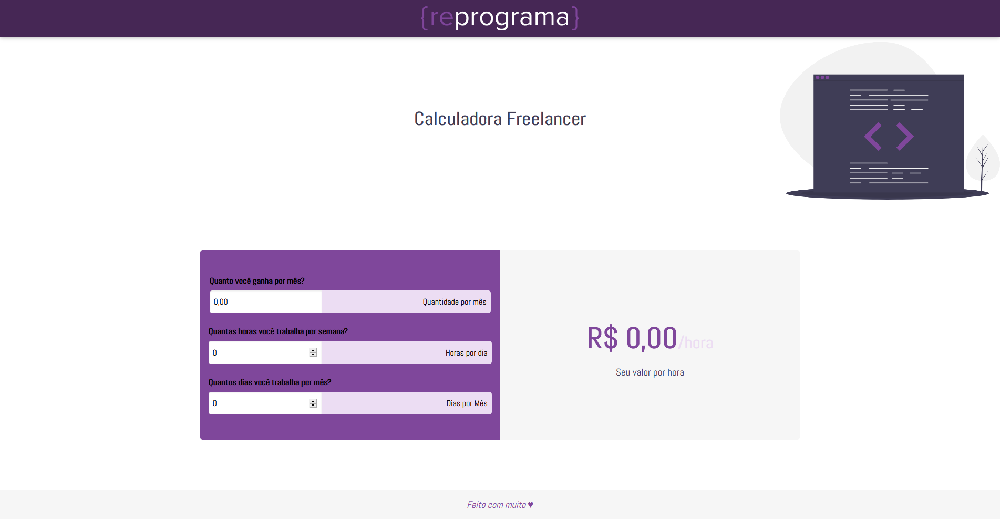
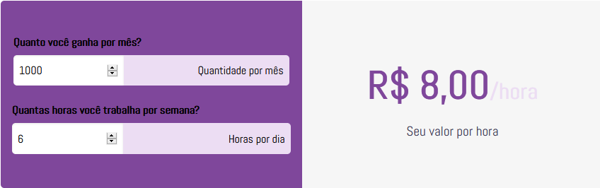

# {reprograma} - calculadora freela

<p align="center">
  
	
  <p align="center">
  O objetivo dessa calculadora é mostrar a partir de determinada entrada de horas trabalhadas vs salário base mês, quanto vale o seu valor/hora.
  </p>
  
</p>

## Introdução

---

### 09hrs~10hrs.

1. Apresentar sobre como será a dinâmica do dia;
2. Apresentar quais desafios serão desenvolvidos no decorrer do dia;
3. Antes de iniciar o projeto técnico em si, apresentar um pouco sobre o que é backend, frontend e se possível, um pouco de mobile, e em qual contexto técnico o desafio do dia será desenvolvido no decorrer do curso.

---

## Início do Desafio

### 10hrs ~ 12hrs

1. Apresentar HTML, CSS bem por cima, e começar o desafio de lógica;
2. Pela manhã, eu coloco como sugestão o desenvolvimento de selecionar todos os dados que o usuário digitar, e chamar uma função imprimindo os valores.

---

## Desenvolvimento do Desafio

### 13hrs ~ 15hrs

1. Minha sugestão aqui é o desenvolvimento do cálculo para as horas;
2. Apresentar o resultado no console e na tela.



---

## Sessão Dúvidas

### 15hrs ~ 16hrs

1. Tempo para dúvidas e finalização do processo para todas as alunas.

---

## Novos Desafios

### 16hrs ~ 17hrs

1. Apresentar quais serão os próximos desafios;
2. As alunas terão 24hrs para realizar o desafio seguinte que será:
2.1. Desenvolver a calculadora "inversa".
Dado uma nova tabela com os valores propostos abaixo, calcule o valor de um projeto com base nos dados:

```
Valor/Hora do seu Projeto x Qtd de Horas * Qtd de Dias;
```

